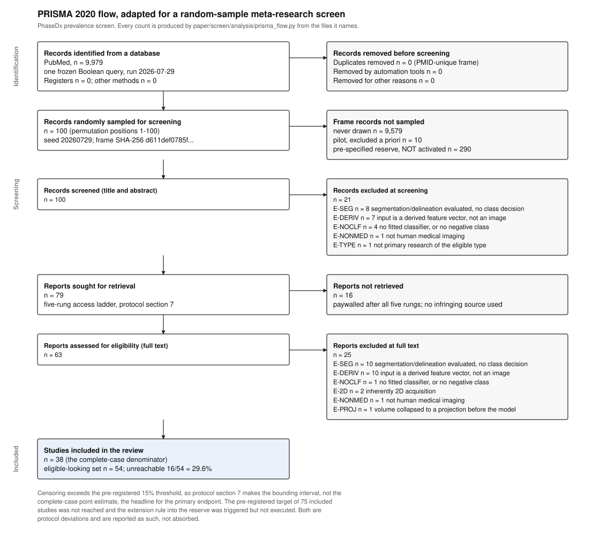

# PRISMA 2020 flow for the PhaseDx prevalence screen

> **SUPERSEDED 2026-07-30 — DO NOT CITE ANY NUMBER FROM THIS FILE.**
>
> This flow covers the analysis sample only (permutation positions 1–100) and reports
> 38 included / 16 not-retrieved / 54 eligible / S6 = 29.6%. Those figures are wrong.
> They were derived from `paper/screen/analysis/recovery_out.json`, which predates the
> v1.2 re-code, and they do not apply codebook rule **D1** — *an unreachable record may be
> coded `excluded` only if `stage1_decision='exclude'`*. Five records (33937792, 42162744,
> 35641181, 35787928, 41874622) were excluded at full text although the full text was never
> obtained. `paper/screen_recoded.json` applies D1 and gives **38 included / 21 unreachable /
> 59 eligible / S6 = 35.6%** for the same 100 papers.
>
> **The authoritative flow is `paper/screen/analysis/pooled_final.json`** (script
> `paper/screen/analysis/pool_final.py`, figure `paper/figures/prisma_flow_pooled.svg`),
> which pools the analysis sample with reserve blocks R1–R3 and gives **250 screened /
> 91 included / 44 unreachable / 135 eligible / S6 = 32.6% [25.3%, 40.9%]**.
>
> Regenerating this file requires `prisma_flow.py` to apply D1 first. See
> `paper/FINDINGS.md` §1.1 and §9.

---


**This file is generated.** Every integer below is written by
`paper/screen/analysis/prisma_flow.py`, which reads the frozen frame, the four sealed
screener files, the v1.2 adjudicated codes and the v1.3 access-recovery overlay. Nothing is
retyped. Regenerate with:

```bash
python paper/screen/analysis/prisma_flow.py
```

It writes this file, the machine-readable `paper/prisma_flow.json`, and the figure
`paper/figures/prisma_flow.svg`. It also asserts its own totals against
`paper/screen/analysis/analysis_out.json` and `paper/screen/analysis/recovery_out.json` and
fails rather than print a figure that disagrees with the published endpoints.

## How PRISMA 2020 is adapted here, and why

This is a **meta-research screen**, not a systematic review of clinical effects. It estimates
how often a reporting practice occurs in a defined literature. Three adaptations follow, each
stated so a reader can see exactly where the diagram departs from the standard template.

1. **A random sample, not a census.** PRISMA's flow assumes every identified record is
   screened. Here the frame is screened by drawing a seeded random permutation and taking the
   first 100 positions. An extra box, *Records randomly sampled for screening*, sits between
   identification and screening, and the records not drawn are accounted for on the right at
   that level rather than being silently dropped. The seed and the frame digest that make the
   draw reproducible are printed in the box itself.
2. **"Reports not retrieved" is an endpoint, not an inconvenience.** In a clinical review the
   unretrieved reports are a footnote. Here reachability is a pre-registered secondary
   endpoint (S6) and, past a pre-registered 15% threshold, it converts the primary estimate
   from a point estimate into a bounding interval. The diagram therefore carries the
   unreachable count and rate into the *Included* box.
3. **Risk of bias in the usual sense does not apply.** The unit of observation is *what a
   paper reports about its own evaluation*, verbatim and quoted, not an effect estimate whose
   internal validity must be judged. The corresponding checklist items are marked adapted, not
   dropped, in `paper/prisma_checklist.md`.

**Stage mapping.** PRISMA's boxes and this codebook's fields are not one-to-one, so the
mapping is declared rather than improvised. Each of the 100 records lands in exactly one
terminal box, determined only by pooled `final_inclusion` and pooled `fulltext_reachable`:

| pooled state | PRISMA box |
|---|---|
| excluded, full text not obtained | records excluded at title/abstract screening |
| eligible-looking, full text not obtained | reports sought for retrieval, not retrieved |
| excluded, full text obtained | reports excluded at full-text assessment, with reason |
| included, full text obtained | studies included |

## The flow (primary: v1.3, post access-recovery)



| stage | n |
|---|---|
| Records identified from PubMed (NCBI E-utilities esearch.fcgi) | 9,979 |
| Duplicate records removed before screening | 0 |
| Records removed by automation tools, or for other reasons | 0 |
| Records in the frozen frame | 9,979 |
| — never drawn | 9,579 |
| — pilot, read by the protocol author, excluded a priori | 10 |
| — pre-specified reserve, **not activated** | 290 |
| **Records randomly sampled and screened (title/abstract)** | **100** |
| Records excluded at screening | 21 |
| **Reports sought for retrieval** | **79** |
| Reports not retrieved | 16 |
| **Reports assessed for eligibility (full text)** | **63** |
| Reports excluded at full text | 25 |
| **Studies included in the review** | **38** |

Eligible-looking set (included + not retrieved) = **54**. Unreachable 16/54 = **29.6%**, against a pre-registered 15% threshold (protocol section 7).

### Exclusions by reason and by stage

| code | meaning | at screening | at full text | total |
|---|---|---|---|---|
| `E-SEG` | segmentation/delineation evaluated, no class decision | 8 | 10 | 18 |
| `E-DERIV` | input is a derived feature vector, not an image | 7 | 10 | 17 |
| `E-NOCLF` | no fitted classifier, or no negative class | 4 | 1 | 5 |
| `E-2D` | inherently 2D acquisition | 0 | 2 | 2 |
| `E-NONMED` | not human medical imaging | 1 | 1 | 2 |
| `E-PROJ` | volume collapsed to a projection before the model | 0 | 1 | 1 |
| `E-TYPE` | not primary research of the eligible type | 1 | 0 | 1 |
| | **total** | **21** | **25** | **46** |

`E-DERIV` is reported separately, as protocol section 9 requires: those papers are inside the query and outside the failure mode the screen is about, so folding them into a single "excluded" total would hide what the frame's imprecision consisted of.

### Reports not retrieved, by PMID

Listed so a reader with better access can finish the screen. n = 16.

```
31634769  37222638  37276106  38082966  38083399  39107903  39423605  39699671
40081198  40147601  40903384  41559509  41617832  41740680  42153825  42489954
```

Three of these — 37222638 (Wiley, bronze), 42153825 (RSNA, CC BY) and 40147601 (Elsevier, CC BY-NC-ND) — are **demonstrably open access** and are unreachable only because this execution environment is refused by those publishers. They are counted as unreachable because no full text was read; the cause is disclosed rather than charged to the literature. Recovering all three would give 13/54 = 24.1%, still above the 15% threshold. Evidence per record: `paper/screen/access_recovery.json`.

## The same flow at each protocol version

Shown so that the effect of the v1.2 adjudication and the v1.3 access recovery is visible line by line rather than asserted.

| stage | v1.0 as sealed | v1.2 adjudicated | v1.3 post-recovery |
|---|---|---|---|
| records screened | 100 | 100 | 100 |
| excluded at screening | 21 | 21 | 21 |
| reports sought for retrieval | 79 | 79 | 79 |
| reports not retrieved | 20 | 20 | 16 |
| reports assessed at full text | 59 | 59 | 63 |
| excluded at full text | 24 | 24 | 25 |
| **studies included** | 35 | 35 | 38 |
| eligible-looking denominator | 55 | 55 | 54 |
| unreachable rate | 36.4% | 36.4% | 29.6% |

**v1.0 to v1.2.** The 15 overlap records are replaced by the v1.2 adjudicated codes. **No terminal-box count changes.** One exclusion *reason* changes: PMID 40335658 moves `E-SEG` to `E-NOCLF` under rule D10, because a categorical class decision was evaluated — by human readers, not by a fitted model — which fails criterion I2 rather than being a pure segmentation paper. The reason tally therefore differs from `analysis_out.json` by one in each of those two codes, and that is the whole difference.

**v1.2 to v1.3.** The access ladder was re-run against every unretrieved report and four were recovered. Three (38591974, 36200353, 39846055) move from *not retrieved* to *included*. The fourth, 36170844, was retrieved and then proved **ineligible** on full text — a U-Net segmentation study with no fitted classifier and no negative class, `E-NOCLF` under D10 — so it moves to *excluded at full text* and **leaves the eligible-looking denominator entirely**, which is why that denominator falls rather than staying fixed. One of the three inclusions (36200353) was coded from an Authorea **preprint** rather than the version of record and is flagged for the version-of-record sensitivity analysis. No sealed screener file was edited; the recovery is an analysis-time overlay.

### Cross-checks against the already-published analysis outputs

| check | this file | published | agree |
|---|---|---|---|
| v1.0 included vs analysis_out.flow.included_and_reachable | 35 | 35 | yes |
| v1.0 unreachable vs analysis_out.flow.eligible_but_unreachable | 20 | 20 | yes |
| v1.0 excluded vs analysis_out.flow.excluded | 45 | 45 | yes |
| v1.0 eligible vs analysis_out.flow.eligible_looking | 55 | 55 | yes |
| v1.3 included vs recovery_out.after.n_included_reachable | 38 | 38 | yes |
| v1.3 unreachable vs recovery_out.after.n_eligible_unreachable | 16 | 16 | yes |
| v1.3 excluded vs recovery_out.after.n_excluded | 46 | 46 | yes |
| v1.3 eligible vs recovery_out.after.n_eligible | 54 | 54 | yes |

## Protocol deviations

Reported here rather than in a supplement, because two of them cap what the screen can claim.

| # | deviation | observed | pre-registered | where |
|---|---|---|---|---|
| 1 | pre-registered target of 75 included studies not reached | 38 | 75 | `paper/screen_protocol.md section 3.1` |
| 2 | extension rule triggered but not executed; the 290-record reserve was never activated | reserve records screened: 0 | continue in blocks of 50 until 75 included or position 400 | `paper/screen_protocol.md section 3.1` |
| 3 | codebook amended to v1.2 after coding began | rules D1-D14 plus four enum levels; no endpoint definition, interval method, threshold or sampling decision altered | n/a -- the remedy is itself pre-registered at section 6 | `paper/screen_protocol.md section 12; paper/screen_adjudication.md` |
| 4 | access ladder re-run after the first analysis (v1.3) | 4 of 20 unretrieved reports recovered; no sealed file edited | n/a -- no rule changed | `paper/screen/access_recovery.json` |
| 5 | no prospective public registry deposit | protocol frozen in git before screening; OSF deposit not made in advance | protocol section 11 named an OSF deposit as an action item to be done before screening | `paper/registration.md` |

Four further things the protocol required that were **not done**, each
of which a reviewer is entitled to see stated plainly:

- **Rung 5 of the access ladder — interlibrary loan or a direct request to the corresponding
  author, with a 21-day wait — was never initiated by any screener.** All four screener files
  say so in their own access notes. Records coded `unreachable_paywalled` should be read as
  "unreachable through rungs 1-4", not "unobtainable".
- **The 20% within-batch re-coding by the next screener in the A→B→C→D→A cycle (protocol
  section 6) was not carried out.** Outside the 15-paper overlap set, disagreement is
  invisible by construction, and no measurement of it exists.
- **Second-screener adjudication of flagged records was not carried out.** Section 6 requires
  it for any record marked `screener_confidence='low'` or `flag_for_adjudication=true`; 49 of
  the 85 single-screened records carry such a flag.
- **A genuine post-amendment reliability estimate does not exist.** The v1.2 figures are a
  counterfactual re-encoding of the same sealed files, not an independent re-rating. A fresh
  four-screener re-coding under v1.2 is an outstanding action and the paper must say so.

None of the four can be repaired by rewriting text. They are labour, and until they are done
the corresponding checklist items in `paper/prisma_checklist.md` are marked **not done**.

### Footnote: records excluded on the abstract that a minority would have read in full

n = 7: 33937792, 35641181, 35787928, 40194851, 40335658, 41874622, 42162744. Each was excluded at title/abstract under the pooled decision, but at least one screener had recorded `stage1_decision=go_to_fulltext` before excluding, and in each case the full text then proved unreachable. Placement changes only which PRISMA box the exclusion is drawn in. It changes no endpoint and no denominator, and both placements are recoverable from `paper/prisma_flow.json`.

## What this flow does and does not license

- The primary endpoint is **zero in every included paper**, and zero in every one of the 149
  codes produced across the whole screen including the excluded and unreachable records. The
  complete-case estimate is therefore a zero count and its precision is entirely the upper
  Wilson bound.
- Because censoring is above the pre-registered 15% threshold, **the bounding interval, not
  the complete-case point estimate, is the headline** for P1, S1, S4 and S5. That rule was
  fixed in the protocol before any record was read, and it survived the access-recovery pass:
  recovering four full texts moved the censoring rate but not past the threshold, and
  recovering the three demonstrably-open-access records that this environment cannot fetch
  would still leave it above the threshold.
- Single screening of 85 of the 100 records, a target sample that was not reached, and an
  extension rule that fired and was not executed, are all real limits on precision. None of
  them can manufacture the primary result in the direction the paper argues: every unmeasured
  or unread record is imputed **against** the paper's own thesis in the upper bound.

## Known inconsistency to fix before submission

`paper/DRAFT.md` Table 5 still reports the **v1.0 as-sealed** flow (35 included, 20
unreachable, 45 excluded) and the v1.0 exclusion tally. The current primary flow is the
**v1.3 post-recovery** one above. Table 5, the abstract and section 3.10 of the draft must be
brought onto the post-recovery numbers, or must state explicitly which version they report.

